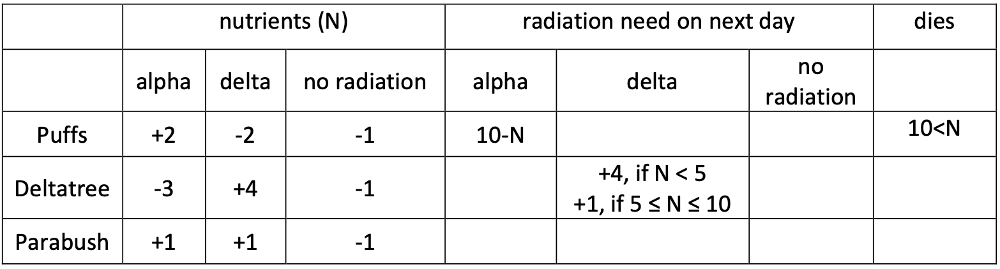
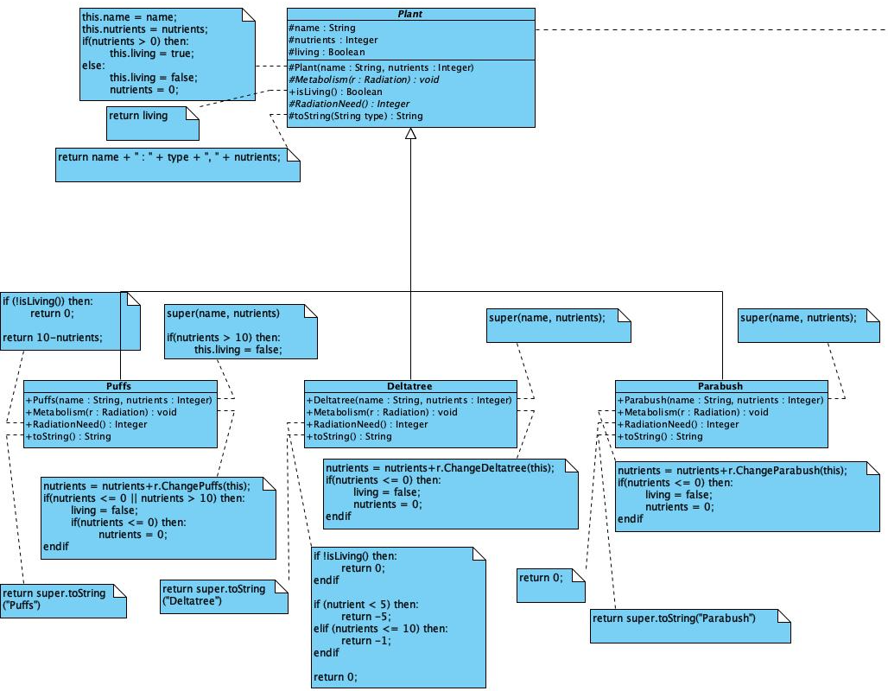
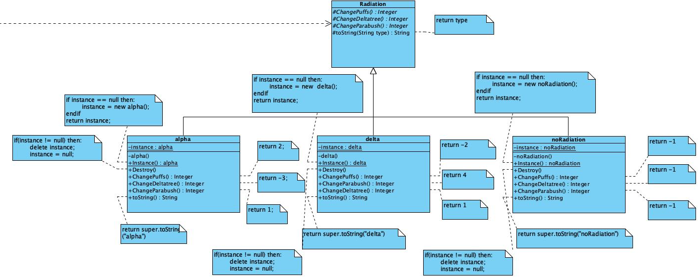
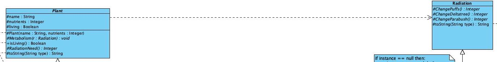

# Programming Technology Assignment1 Documentation

Hidekazu Ueba (IKS26R) 

# Contents
- Task Description
- Design Plan
  - Design pattern
- Class Diagram
- Description of methods
  - Plant
    - Plant class
    - Puffs class
    - Deltatree class
    - Parabush class
  - Radiation
    - Radiation class
    - alpha class
    - delta class
    - noRadiation class 
- Test

# Task Description
There is a planet, where different kind of plants are living. All the plants are using nutrients to live. If a plant runs out of its nutrients, it dies. </br>
Each day one radiation type can occur from the followings: alpha, delta, or no radiation. Radiations affect the plants differently based on their types.</br>
The reaction of a plant to a given radiation consists of the following: it changes its nutrient level, and affects the radiation of the next day. 

The radiation of the next day:	
- alpha, if the need for alpha radiation is 3 or more greater than for the delta radiation					
- delta, if the need for delta radiation is 3 or more greater than for the alpha radiation				
- no radiation, otherwise		
		 					
There is no radiation on the first day...</br>				
Simulate the behaviors of the plants, and print out the radiation of the day and the properties of the plants on each day.</br>	

Properties of the plants: 
- name (string)
- nutrients (integer) 
- living (boolean)

The types of the plants in the simulation: 
- puffs
- deltatree
- parabush

On a day of the the simulation the living plant first changes its nutrients, then if it is still alive, it can affect the radiation of the next day.



Read the data of the simulation from a text file. </br>
The first line contains the number (n) of the plants. </br>
The following n lines contain the information about the plants: 
- name, type, initial nutrient level. 

Type is represented by one character: 
- p - Puffs, d - Deltratree, b - Parabush. 

The last line of the file defines the number of the days you have to simulate.
The program should ask for the name of the file, and it has to print out the name of the survivors (we can assume that the file is existing and its format is valid).

A possible file content:<br >
4<br>
Piggy p 7<br>
Slender d 5<br>
Dumpy b 4 <br>
Willowy d 3 <br>
10	

# Design Plan
### Design pattern:  visitor, singleton

First, a visitor design pattern is used between Plant and Radiation.<br>
In this case, Element = Plant and Visitor = Radiation.<br>
Plant's method takes a Radiation object as an argument and overrides it to perform different processing in the child class.<br>
In Radiation, I created methods for each of the different child classes of the Plant class.<br>

Next, all of Radiation's child classes are singletons, because it is sufficient to have one of each of these Instances.

# Class Diagram







# Description of the method
## Plant
- ## Plant class
#### 1. Metabolism()
```Java
/** 
* This is an abstract method that should be overriden in the children.
* This method will change the value of nutriants attribute depending on r.
* @param r  an Radiation object
* @return void 
*/
protected abstract void Metabolism(Radiation r);
```
#### 2. radiationNeed()
```Java
/** 
* This is an abstract method that should be overriden in the children.
* This method will calculate the value of the radiation need.
* negative value indicates delta-radiation
* positive value indicates alpha-radiation
* ex) +3 => radiation need is amount 3 alpha-radiation
* ex) -2 => radiation need is amount 2 delta-radiation
* @param none no parameter 
* @return the value of the radiation need. 
*/
protected abstract int radiationNeed();
```

#### 3. toString()
```Java
/** 
* This method returns object information as a string.
* @param type  name of the plant(puffs/deltatree/parabush) 
* @return string representation of the object itself
*/
protected String toString(String type){
    return name + " : " + type + ", " + nutrients;
}
```

- ## Puffs class
#### 1. Metabolism()
```Java
/** 
* This is a method that overrides the abstract method of Plant class. 
* This method will change the value of "nutriants" attribute depending on r.
* In the if statement, it changes the value of "living" attribute. Because Puffs is die when its "nutriants" attribute becomes less than equal 0 or greater than equal 10. So "living" attribute will be "false" in this time.
* "nutriants" may be less than 0. In this case, stop its value at 0.
* @param r  an Radiation object
* @return void 
*/
public void Metabolism(Radiation r){
    nutrients += r.ChangePuffs(this);
    if(nutrients <= 0 || nutrients > 10){
        living = false;
        if(nutrients < 0){
            nutrients = 0;
        }
    }
}
```
#### 2. radiationNeed()
```Java
/** 
* This is a method that overrides the abstract method of Plant class.
* This method will calculate the value of the radiation need.
* negative value indicates delta-radiation
* positive value indicates alpha-radiation
* ex) +3 => radiation need is amount 3 alpha-radiation
* ex) -2 => radiation need is amount 2 delta-radiation
* @param none no parameter 
* @return the value of the radiation need. 
*/
public int radiationNeed(){
    if(!isLiving()){
        return 0;
    }
    return 10 - nutrients;
}
```
#### 3. toString()
```Java
/** 
* This method returns object information as a string.
* This is a method that overrides the method of Plant class.
* @param none 
* @return string representation of the object itself
*/
public String toString(){
    return super.toString("Puffs");
}
```

- ## Deltatree class
#### 1. Metabolism()
```Java
/** 
* This is a method that overrides the abstract method of Plant class. 
* This method will change the value of "nutriants" attribute depending on r.
* In the if statement, it changes the value of "living" attribute. "living" attribute will be "false" when "nutrients" attribute becomes less than equal 0.
* "nutriants" may be less than 0. In this case, stop its value at 0.
* @param r  an Radiation object
* @return void 
*/
public void Metabolism(Radiation r){
    nutrients += r.ChangeDeltatree(this);
    if(nutrients <= 0){
        living = false;
        nutrients = 0;
    }
}
```

#### 2. radiationNeed()
```Java
/** 
* This is a method that overrides the abstract method of Plant class.
* This method will calculate the value of the radiation need.
* negative value indicates delta-radiation
* positive value indicates alpha-radiation
* ex) +3 => radiation need is amount 3 alpha-radiation
* ex) -2 => radiation need is amount 2 delta-radiation
* @param none no parameter 
* @return the value of the radiation need. 
*/
public int radiationNeed(){
    if(!isLiving()){
        return 0;
    }
    
    if(nutrients < 5){
        return -4;
    }else if(nutrients <= 10){
        return -1;
    }
    
    return 0;
}
```

#### 3. toString()
```Java
/** 
* This method returns object information as a string.
* This is a method that overrides the method of Plant class.
* @param none 
* @return string representation of the object itself
*/
public String toString(){
    return super.toString("Puffs");
}
```

- ## Parabush class
#### 1. Metabolism()
```Java
/** 
* This is a method that overrides the abstract method of Plant class. 
* This method will change the value of "nutriants" attribute depending on r.
* In the if statement, it changes the value of "living" attribute. "living" attribute will be "false" when "nutrients" attribute becomes less than equal 0.
* "nutriants" may be less than 0. In this case, stop its value at 0.
* @param r  an Radiation object
* @return void 
*/
public void Metabolism(Radiation r){
    nutrients += r.ChangeParabush(this);
    if(nutrients <= 0){
        living = false;
        nutrients = 0;
    }
}
```

#### 2. radiationNeed()
```Java
/** 
* This is a method that overrides the abstract method of Plant class.
* This method will calculate the value of the radiation need.
* negative value indicates delta-radiation
* positive value indicates alpha-radiation
* ex) +3 => radiation need is amount 3 alpha-radiation
* ex) -2 => radiation need is amount 2 delta-radiation
* @param none no parameter 
* @return the value of the radiation need. 
*/
@Override
public int radiationNeed(){
    return 0;
}
```
#### 3. toString()
```Java
/** 
* This method returns object information as a string.
* This is a method that overrides the method of Plant class.
* @param none 
* @return string representation of the object itself
*/
public String toString(){
    return super.toString("Parabush");
}
```

## Radiation
- ## Radiation class
#### 1. ChangePuffs()
  ```Java
  /** This method calculates the consumption of nutrients for Puffs.
   * This will be overriden in the child class.
  * @param none 
  * @return Nutrient Consumption
  */
  protected abstract int ChangePuffs();
  ```

#### 2. ChangeDeltatree()
  ```Java
  /** This method calculates the consumption of nutrients for Deltatree.
   * This will be overriden in the child class.
  * @param none
  * @return Nutrient Consumption
  */
  protected abstract int ChangeDeltatree();
  ```

#### 3. ChangeParabush()
  ```Java
  /** This method calculates the consumption of nutrients for Parabush.
   * This will be overriden in the child class.
  * @param none
  * @return Nutrient Consumption
  */
  protected abstract int ChangeParabush();
  ```

#### 4. toString()
  ```Java
  /** 
  * This method returns object information as a string.
  * @param type  name of the plant(puffs/deltatree/parabush) 
  * @return string of its radiation-type 
  */
  * @param none
  * @return Nutrient Consumption
  */
  protected String toString(String type){
      return type;
  }
  ```


- ## alpha class
#### 1. ChangePuffs()
  ```Java
  /** This method calculates the consumption of nutrients for Puffs.
   * This is a method that overrides the abstract method of Plant class.
  * @param none 
  * @return 2
  */
  public int ChangePuffs(){
      return 2;
  }
  ```

#### 2. ChangeDeltatree()
  ```Java
  /** This method calculates the consumption of nutrients for Deltatree.
   * This is a method that overrides the abstract method of Plant class.
  * @param none
  * @return -3
  */
  public int ChangeDeltatree(){
      return -3;
  }
  ```

#### 3. ChangeParabush()
  ```Java
  /** This method calculates the consumption of nutrients for Parabush.
   * This is a method that overrides the abstract method of Plant class.
  * @param none
  * @return 1
  */
  public int ChangeParabush(){
      return 1;
  }
  ```
- ## delta class
#### 1. ChangePuffs()
  ```Java
  /** This method calculates the consumption of nutrients for Puffs.
   * This is a method that overrides the abstract method of Plant class.
  * @param none 
  * @return -2
  */
  public int ChangePuffs(){
      return -2;
  }
  ```

#### 2. ChangeDeltatree()
  ```Java
  /** This method calculates the consumption of nutrients for Deltatree.
   * This is a method that overrides the abstract method of Plant class.
  * @param none
  * @return 4
  */
  public int ChangeDeltatree(){
      return 4;
  }
  ```

#### 3. ChangeParabush()
  ```Java
  /** This method calculates the consumption of nutrients for Parabush.
   * This is a method that overrides the abstract method of Plant class.
  * @param none
  * @return 1
  */
  public int ChangeParabush(){
      return 1;
  }
  ```
- ## noRadiation class
#### 1. ChangePuffs()
  ```Java
  /** This method calculates the consumption of nutrients for Puffs.
   * This is a method that overrides the abstract method of Plant class.
  * @param none 
  * @return -1
  */
  public int ChangePuffs(){
      return -1;
  }
  ```

#### 2. ChangeDeltatree()
  ```Java
  /** This method calculates the consumption of nutrients for Deltatree.
   * This is a method that overrides the abstract method of Plant class.
  * @param none
  * @return -1
  */
  public int ChangeDeltatree(){
      return -1;
  }
  ```

#### 3. ChangeParabush()
  ```Java
  /** This method calculates the consumption of nutrients for Parabush.
   * This is a method that overrides the abstract method of Plant class.
  * @param none
  * @return -1
  */
  public int ChangeParabush(){
      return -1;
  }
  ```


# Test


<style>
table {
    border-collapse: collapse;
    width: 100%;
}

th, td {
    border: 1px solid black;
    padding: 8px;
    text-align: left;
}
</style>

|| description | input | output |
|-----------| ------ | ------------- | ------------- |
|1|Basic simulation|input1.txt|Dumpy : Parabush, 6 |
|2|Plants are inputted, but <br>all are dead from the beginning. (Nutrients <= 0)|input2.txt|no plant living |
|3|Alpha Radiation's need is greater than <br>Delta Radiation by more than 3 in the second day <br>to check alpha's effection is correct.|input3.txt|Piggy : Puffs, 8<br> Slender : Deltatree, 2<br>Dumpy : Parabush, 2 |
|4|Delta Radiation's need is greater than <br>Alpha Radiation by more than 3 in the second day <br>to check delta's effection is correct.|input4.txt|Piggy : Puffs, 7<br>Slender : Deltatree, 8<br> Dumpy : Parabush, 2|
|5|Since the first day is noRadiation, <br>we will check if the effect of noRadiation is correct <br>after only one day of progress.|input5.txt|Piggy : Puffs, 9<br>Slender : Deltatree, 4<br>Dumpy : Parabush, 1|


