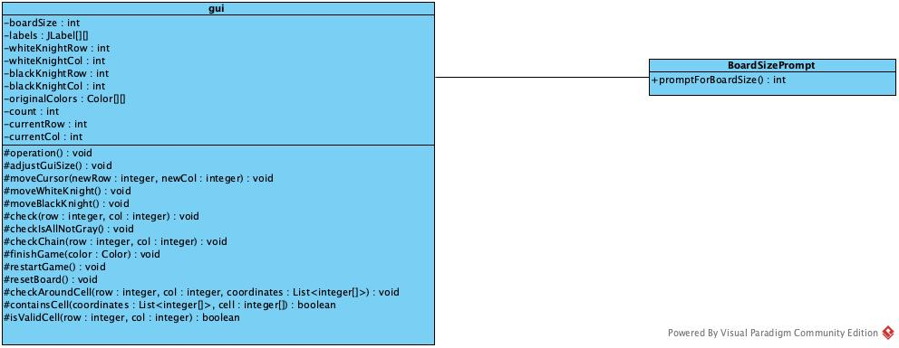
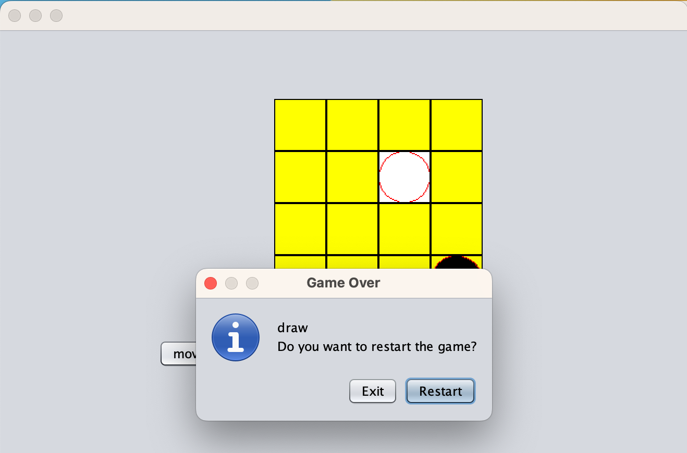
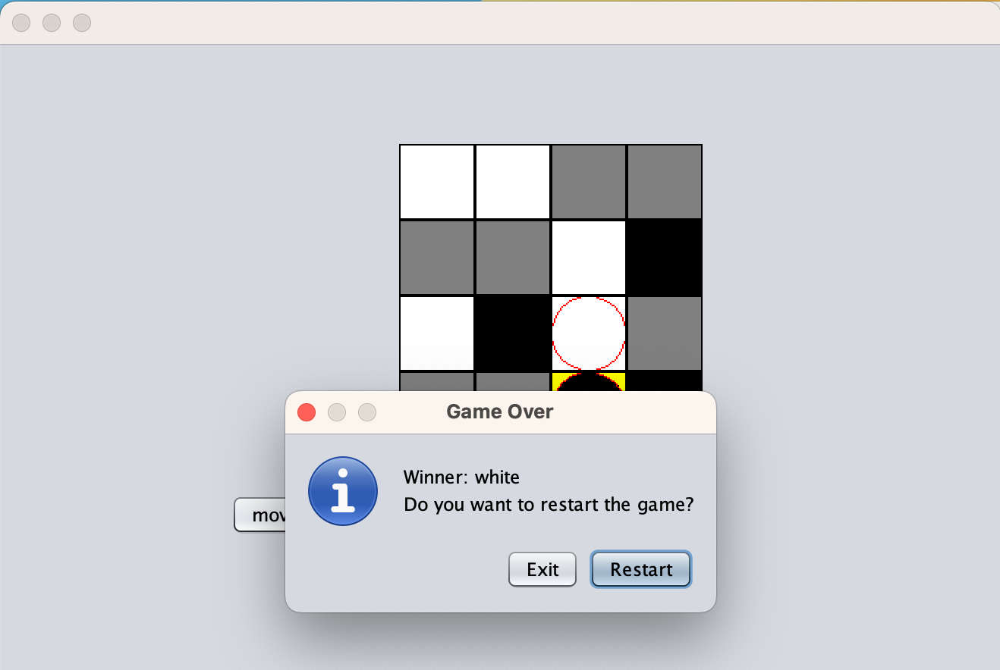
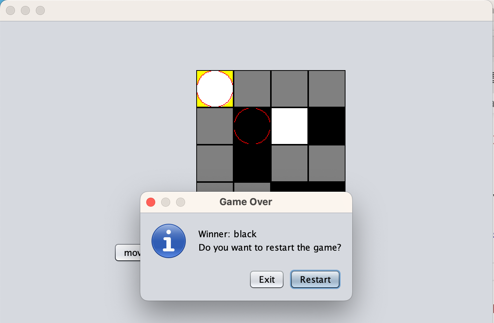
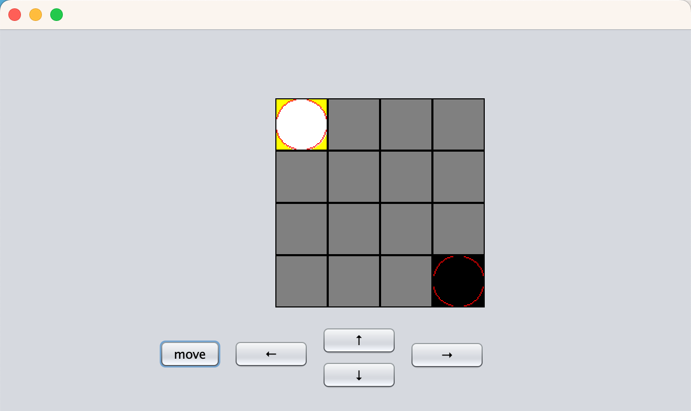
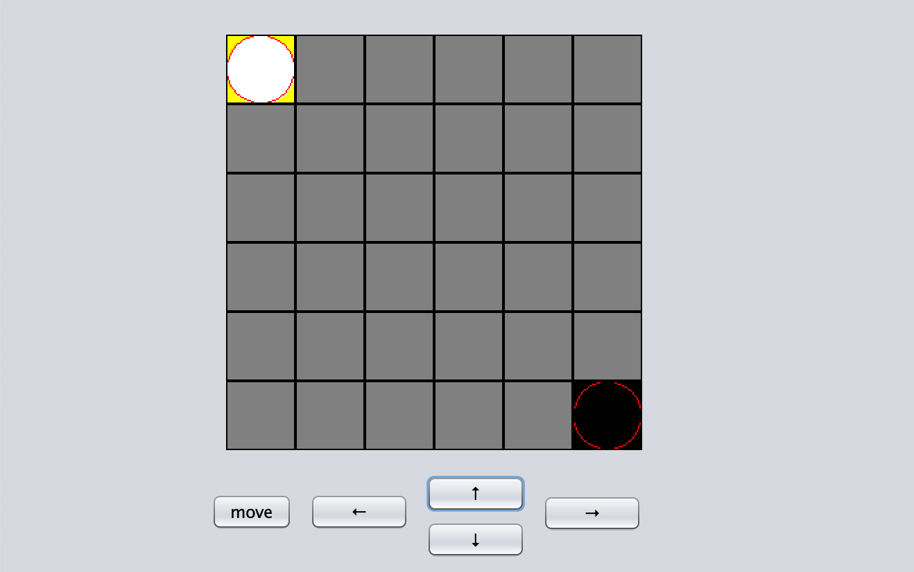
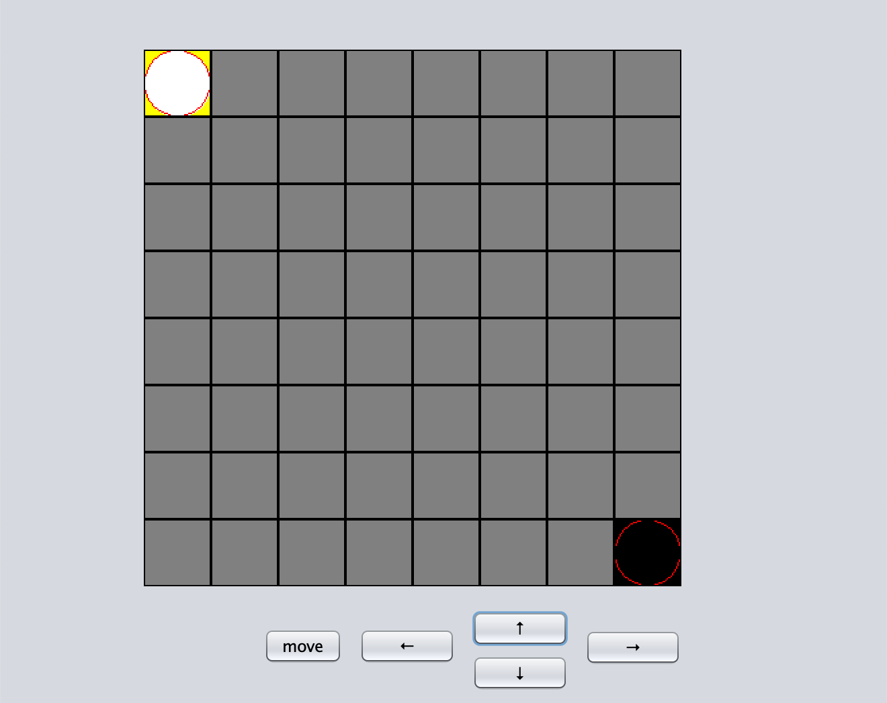

# Knight Tournament Game Documentation

## Exercise Description

This two-player game is played on an n x n board. Two white and two black knights are initially placed at the corners of the board (knights of the same color are placed at opposite corners). Players take turns, and knights move in an L shape, similar to chess knights. After each move, the visited places are colored with the color of the moving knight. A player wins if there are 4 adjacent fields (horizontally, vertically, or diagonally) colored with the player's color. The game ends when there are no more grey fields. The game allows the selection of the board size (4x4, 6x6, 8x8) and automatically starts a new game after completion.

## Class Diagram

  

### `public class Gui`

#### `public Gui()`

- **Description**: Constructor for the GUI class.
- **Methods**:
  - `createGridLabels()`: Creates grid labels for the game board.
  - `adjustGuiSize()`: Adjusts the size of the GUI based on the board size.
  - `moveCursor(int newRow, int newCol)`: Moves the cursor to a new cell.
  - `moveWhiteKnight()`: Moves the white knight based on user input.
  - `moveBlackKnight()`: Moves the black knight based on user input.
  - `check(int row, int col)`: Checks for a win or draw condition.
  - `checkIsAllNotGray()`: Checks if all cells are not grey.
  - `checkChain(int row, int col)`: Checks for a chain of connected cells.
  - `finishGame(Color color)`: Finishes the game and displays the winner.
  - `restartGame()`: Restarts the game.
  - `resetBoard()`: Resets the game board.
  - `checkAroundCell(int row, int col, List<int[]> coordinates)`: Checks around a given cell for a chain.
  - `containsCell(List<int[]> coordinates, int[] cell)`: Checks if a list of coordinates contains a specific cell.
  - `isValidCell(int row, int col)`: Checks if the cell coordinates are valid.

### `public class BoardSizePrompt`

- **Description**: Show the Board Size Prompt.
- **Methods**:
  - `promptForBoardSize()`: Decide the board size.

## Event Handlers

- `jButton1`: Handles the "Up" button click event.
- `jButton2`: Handles the "Right" button click event.
- `jButton3`: Handles the "Down" button click event.
- `jButton4`: Handles the "Left" button click event.
- `jButton6`: Handles the "Move" button click event.

## Connections Between Events and Event Handlers

- `jButton1` click event connects to the `jButton1ActionPerformed` method.
- `jButton2` click event connects to the `jButton2ActionPerformed` method.
- `jButton3` click event connects to the `jButton3ActionPerformed` method.
- `jButton4` click event connects to the `jButton4ActionPerformed` method.
- `jButton6` click event connects to the `jButton6ActionPerformed` method.

## Test Cases

### 1. When all cells are colored, and the result is a draw

**Description:** The game progresses, and all cells are colored (not gray), resulting in a draw.

**Expected Result:** The game-over message is displayed, indicating a draw. The game restarts.

### 2. When white wins

**Description:** White knights occupy four consecutive cells, leading to a victory for the white player.

**Expected Result:** The game-over message is displayed, indicating that white is the winner. The game restarts.

### 3. When black wins

**Description:** Black knights occupy four consecutive cells, leading to a victory for the black player.

**Expected Result:** The game-over message is displayed, indicating that black is the winner. The game restarts.

### 4. When the grid size is 4x4, and the GUI displays and functions correctly

**Description:** The game board is set to a size of 4x4, and the GUI is displayed correctly, with functional gameplay.

**Expected Result:** A 4x4 board is shown, allowing the player to engage in the game. The game progresses correctly.

### 5. When the grid size is 6x6, and the GUI displays and functions correctly

**Description:** The game board is set to a size of 6x6, and the GUI is displayed correctly, with functional gameplay.

**Expected Result:** A 6x6 board is shown, allowing the player to engage in the game. The game progresses correctly.

### 6. When the grid size is 8x8, and the GUI displays and functions correctly

**Description:** The game board is set to a size of 8x8, and the GUI is displayed correctly, with functional gameplay.

**Expected Result:** An 8x8 board is shown, allowing the player to engage in the game. The game progresses correctly.

