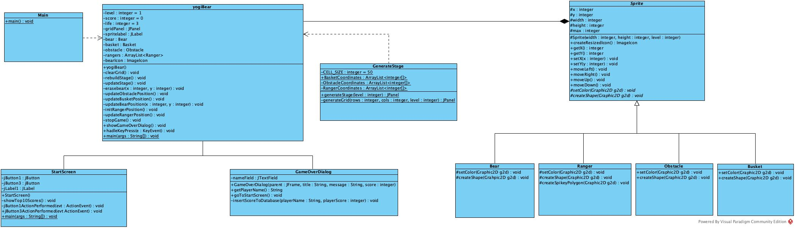
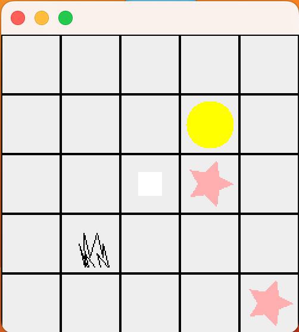
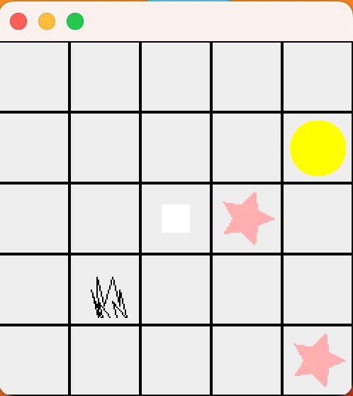
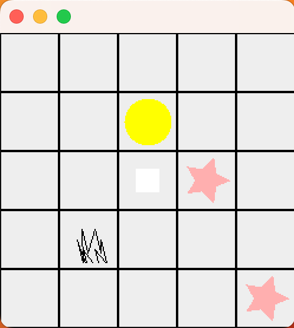
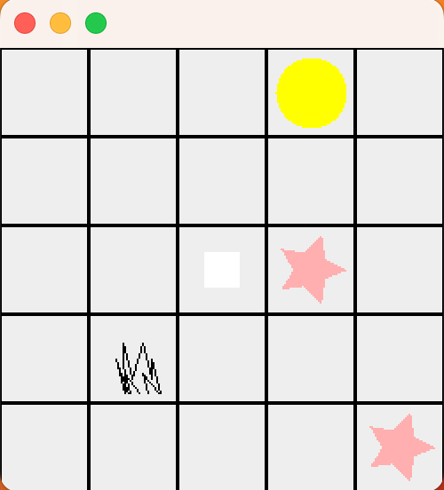
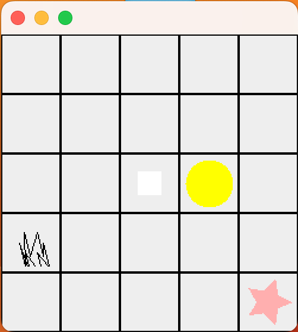
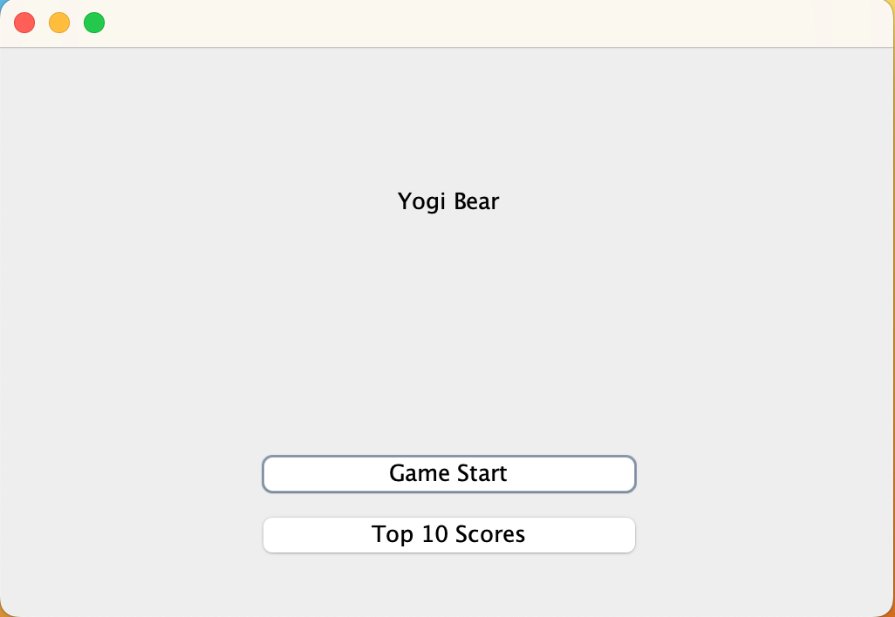
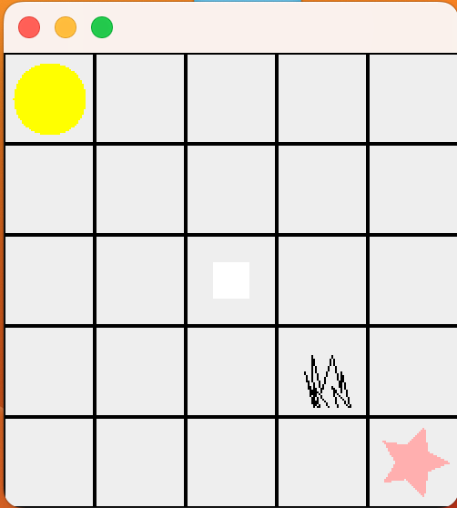
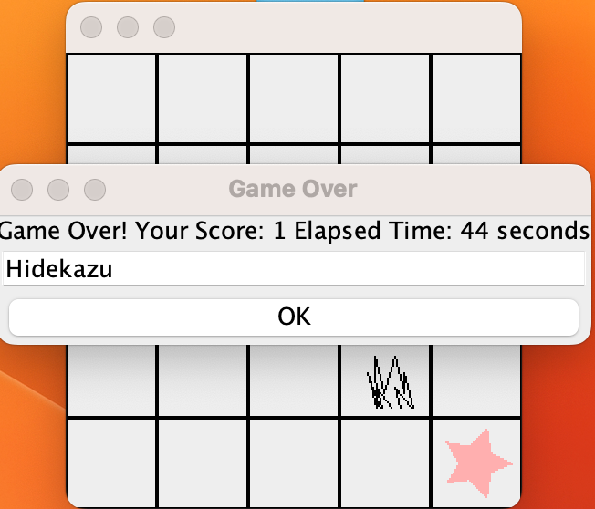
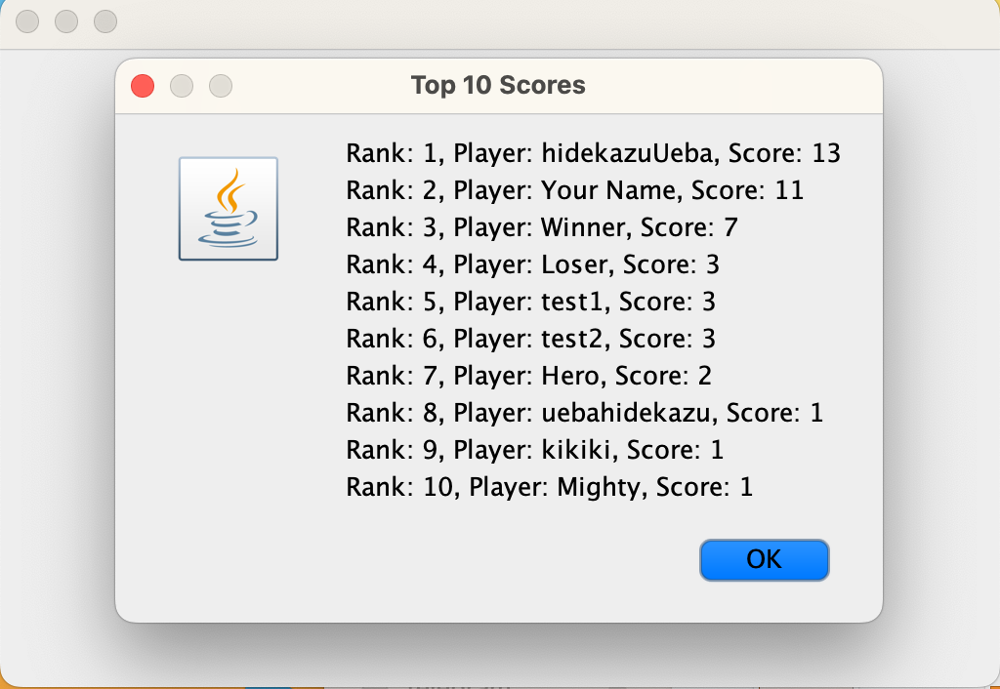

# Yogi Bear Game Documentation

## Description

Yogi Bear embarks on an adventure to collect picnic baskets in the Yellowstone National Park. The forest is filled with obstacles such as mountains and trees, along with rangers who make basket collection challenging. Rangers move horizontally or vertically, and if they get too close to Yogi, he loses a life. Yogi respawns at the park entrance if lives remain. The game keeps track of collected baskets. Completing all baskets loads a new level. Losing all lives prompts the player to enter their name for the highscore table.

## Analysis

The game involves sprite movement, obstacle detection, and scoring. Highscores and game restart functionality enhance user experience. Simple graphics and keyboard controls (WASD) make the game accessible. A timer measures elapsed time during gameplay.

## Structure (UML Class Diagram)



# Implementation

### Level Generation

Levels can be generated using algorithms. A basic approach is to randomly place obstacles, rangers, and picnic baskets in the park while ensuring the level is solvable.

### Timer Implementation

Utilize the `javax.swing.Timer` class to create a game timer that updates every second. Display the elapsed time on the UI.

### Highscore Table

Implement a popup to enter the player's name when lives run out. Store and display the top 10 scores in a highscore table.

### Menu Items

- **Highscores**: Displays the highscore table.
- **Restart Game**: Restarts the game.

### Connections Between Events and Handlers

- KeyPress events are handled by `handleKeyPress()` method.
- Timer events update the elapsed time using `updateElapsedTime()`.

# Methods


## yogiBear Class Methods

### Constructor

#### `yogiBear()`
- **Description**: Creates a new instance of the `yogiBear` class.
- **Parameters**: None
- **Returns**: None
- **Usage**:
    ```java
    yogiBear game = new yogiBear();
    ```

### Private Methods

#### `clearGrid()`
- **Description**: Clears the grid by removing icons from its components.
- **Parameters**: None
- **Returns**: None

#### `rebuildStage()`
- **Description**: Rebuilds the game stage with updated elements.
- **Parameters**: None
- **Returns**: None

#### `updateStage()`
- **Description**: Updates the game stage with initial elements.
- **Parameters**: None
- **Returns**: None

#### `eraseBear(int x, int y)`
- **Description**: Erases the bear icon at the specified position on the grid.
- **Parameters**:
  - `x` (int): X-coordinate of the bear.
  - `y` (int): Y-coordinate of the bear.
- **Returns**: None

#### `updateObstaclePosition()`
- **Description**: Updates the obstacle positions on the grid.
- **Parameters**: None
- **Returns**: None

#### `updateBusketPosition()`
- **Description**: Updates the basket positions on the grid.
- **Parameters**: None
- **Returns**: None

#### `updateBearPosition(int x, int y)`
- **Description**: Updates the bear position on the grid.
- **Parameters**:
  - `x` (int): X-coordinate of the bear.
  - `y` (int): Y-coordinate of the bear.
- **Returns**: None

#### `initRangerPosition()`
- **Description**: Initializes and updates the ranger positions on the grid.
- **Parameters**: None
- **Returns**: None

#### `updateRangerPosition()`
- **Description**: Updates the ranger positions on the grid.
- **Parameters**: None
- **Returns**: None

#### `stopGame()`
- **Description**: Stops the game timer and disables key event listeners.
- **Parameters**: None
- **Returns**: None

#### `showGameOverDialog()`
- **Description**: Displays a game over dialog with the final score and elapsed time.
- **Parameters**: None
- **Returns**: None

#### `handleKeyPress(KeyEvent e)`
- **Description**: Handles key presses and updates the bear position accordingly.
- **Parameters**:
  - `e` (KeyEvent): The KeyEvent object representing the key press.
- **Returns**: None

### Timer-related Methods

#### `updateElapsedTime()`
- **Description**: Updates the elapsed time every second.
- **Parameters**: None
- **Returns**: None

## GenerateStage Class Methods

### Public Methods

#### `generateStage(int level)`
- **Description**: Generates and returns a game stage based on the specified level.
- **Parameters**:
  - `level` (int): The level of the game.
- **Returns**:
  - `javax.swing.JPanel`: The generated game stage.

### Private Methods

#### `generateGrid(int rows, int cols, int level)`
- **Description**: Generates a grid with the specified number of rows and columns.
- **Parameters**:
  - `rows` (int): The number of rows in the grid.
  - `cols` (int): The number of columns in the grid.
  - `level` (int): The level of the game.
- **Returns**:
  - `javax.swing.JPanel`: The generated grid panel.


## Sprite Class

### Abstract Methods

#### `createResizedIcon()`
- **Description**: Creates and returns a resized ImageIcon based on the sprite's properties.
- **Returns**:
  - `ImageIcon`: The resized ImageIcon.

#### `setColor(Graphics2D g2d)`
- **Description**: Sets the color for the sprite in the given `Graphics2D` context.
- **Parameters**:
  - `g2d` (Graphics2D): The Graphics2D context.

#### `createShape(Graphics2D g2d)`
- **Description**: Creates the shape for the sprite in the given `Graphics2D` context.
- **Parameters**:
  - `g2d` (Graphics2D): The Graphics2D context.

#### `getX()`
- **Description**: Gets the x-coordinate of the sprite.
- **Returns**:
  - `int`: The x-coordinate.

#### `setX(int x)`
- **Description**: Sets the x-coordinate of the sprite.
- **Parameters**:
  - `x` (int): The new x-coordinate.

#### `getY()`
- **Description**: Gets the y-coordinate of the sprite.
- **Returns**:
  - `int`: The y-coordinate.

#### `setY(int y)`
- **Description**: Sets the y-coordinate of the sprite.
- **Parameters**:
  - `y` (int): The new y-coordinate.

#### `moveRight()`
- **Description**: Moves the sprite to the right.

#### `moveLeft()`
- **Description**: Moves the sprite to the left.

#### `moveUp()`
- **Description**: Moves the sprite up.

#### `moveDown()`
- **Description**: Moves the sprite down.

## Bear Class

### Constructor

#### `Bear(int width, int height, int level)`
- **Description**: Constructs a Bear sprite with the specified width, height, and level.
- **Parameters**:
  - `width` (int): The width of the sprite.
  - `height` (int): The height of the sprite.
  - `level` (int): The level of the game.

### Overridden Methods

#### `setColor(Graphics2D g2d)`
- **Description**: Sets the color for the Bear sprite in the given `Graphics2D` context.

#### `createShape(Graphics2D g2d)`
- **Description**: Creates the shape for the Bear sprite in the given `Graphics2D` context.

## Ranger Class

### Constructor

#### `Ranger(int width, int height, int level, int x, int y)`
- **Description**: Constructs a Ranger sprite with the specified width, height, level, x, and y.
- **Parameters**:
  - `width` (int): The width of the sprite.
  - `height` (int): The height of the sprite.
  - `level` (int): The level of the game.
  - `x` (int): The initial x-coordinate of the Ranger.
  - `y` (int): The initial y-coordinate of the Ranger.

### Overridden Methods

#### `setColor(Graphics2D g2d)`
- **Description**: Sets the color for the Ranger sprite in the given `Graphics2D` context.

#### `createShape(Graphics2D g2d)`
- **Description**: Creates the shape for the Ranger sprite in the given `Graphics2D` context.

## Obstacle Class

### Constructor

#### `Obstacle(int width, int height, int level)`
- **Description**: Constructs an Obstacle sprite with the specified width, height, and level.
- **Parameters**:
  - `width` (int): The width of the sprite.
  - `height` (int): The height of the sprite.
  - `level` (int): The level of the game.

### Overridden Methods

#### `setColor(Graphics2D g2d)`
- **Description**: Sets the color for the Obstacle sprite in the given `Graphics2D` context.

#### `createShape(Graphics2D g2d)`
- **Description**: Creates the shape for the Obstacle sprite in the given `Graphics2D` context.

## Basket Class

### Constructor

#### `Basket(int width, int height, int level)`
- **Description**: Constructs a Basket sprite with the specified width, height, and level.
- **Parameters**:
  - `width` (int): The width of the sprite.
  - `height` (int): The height of the sprite.
  - `level` (int): The level of the game.

### Overridden Methods

#### `setColor(Graphics2D g2d)`
- **Description**: Sets the color for the Basket sprite in the given `Graphics2D` context.

#### `createShape(Graphics2D g2d)`
- **Description**: Creates the shape for the Basket sprite in the given `Graphics2D` context.

## StartScreen Class

### Constructor

#### `StartScreen()`
- **Description**: Constructs a new StartScreen.

### Private Methods

#### `showTop10Scores()`
- **Description**: Fetches and displays the top 10 scores from the database.
- **Parameters**: None.
- **Returns**: None.

### Auto-generated Code

#### `initComponents()`
- **Description**: Initializes the components of the StartScreen. (Auto-generated by NetBeans)
- **Parameters**: None.
- **Returns**: None.

### Event Handlers

#### `jButton1ActionPerformed(java.awt.event.ActionEvent evt)`
- **Description**: Handles the "Game Start" button click event.
- **Parameters**:
  - `evt` (ActionEvent): The ActionEvent object.
- **Returns**: None.

#### `jButton3ActionPerformed(java.awt.event.ActionEvent evt)`
- **Description**: Handles the "Top 10 Scores" button click event.
- **Parameters**:
  - `evt` (ActionEvent): The ActionEvent object.
- **Returns**: None.

#### `main(String args[])`
- **Description**: The main method to launch the StartScreen application.
- **Parameters**:
  - `args` (String[]): Command line arguments.
- **Returns**: None.

#### `jButton1`
- **Description**: JButton for starting the game.

#### `jButton3`
- **Description**: JButton for displaying top 10 scores.

#### `jLabel1`
- **Description**: JLabel displaying the title "Yogi Bear".

### Main Method

#### `main(String args[])`
- **Description**: The main method to launch the StartScreen application.
- **Parameters**:
  - `args` (String[]): Command line arguments.
- **Returns**: None.

### Variables Declaration

#### `jButton1`
- **Description**: JButton for starting the game.

#### `jButton2`
- **Description**: (Unused) jButton2.

#### `jButton3`
- **Description**: JButton for displaying top 10 scores.

#### `jLabel1`
- **Description**: JLabel displaying the title "Yogi Bear".

## GameOverDialog Class

### Constructor

#### `GameOverDialog(JFrame parent, String title, String message, int score)`
- **Description**: Constructs a new GameOverDialog.
- **Parameters**:
  - `parent` (JFrame): The parent JFrame.
  - `title` (String): The title of the dialog.
  - `message` (String): The message to be displayed.
  - `score` (int): The player's score.

### Public Methods

#### `getPlayerName()`
- **Description**: Gets the player's name from the nameField.
- **Parameters**: None.
- **Returns**:
  - `String`: The player's name.

#### `goToStartScreen()`
- **Description**: Navigates to the StartScreen.
- **Parameters**: None.
- **Returns**: None.

### Private Methods

#### `insertScoreToDatabase(String playerName, int playerScore)`
- **Description**: Inserts the player's score and name into the database.
- **Parameters**:
  - `playerName` (String): The player's name.
  - `playerScore` (int): The player's score.
- **Returns**: None.

### Auto-generated Code

#### `main(String args[])`
- **Description**: The main method for the GameOverDialog class.
- **Parameters**:
  - `args` (String[]): Command line arguments.
- **Returns**: None.

#### `nameField`
- **Description**: JTextField for entering the player's name.

### Variables Declaration

#### `nameField`
- **Description**: JTextField for entering the player's name.

# YogiBear Test Cases


1. **Testing Player Movement**
   - **Input**: Using arrow keys or movement controls to navigate Yogi Bear in different directions.
     1. Call `moveRight` method on Yogi Bear
     2. Call `moveLeft` method on Yogi Bear
     3. Call `moveUp` method on Yogi Bear
     4. Call `moveDown` method on Yogi Bear
   - **Expected Output**: 
    Verify that Yogi Bear moves accordingly, and the game responds to player input.
     
     1. Confirm that Yogi Bear's X-coordinate is increased by 1.
     
     2. Ensure that Yogi Bear's X-coordinate is decreased by 1.
     3. Verify that Yogi Bear's Y-coordinate is decreased by 1.
     4. Confirm that Yogi Bear's Y-coordinate is increased by 1.

2. **Testing Game Initialization**
   - **Input**: Starting the game by launching the application
   - **Expected Output**: Ensure that the game initializes correctly, displaying the start screen with the Yogi Bear title.

3. **Testing Game Start**
   - **Input**: Clicking the "Game Start" button on the start screen
   - **Expected Output**: Confirm that the game screen appears, and Yogi Bear is displayed at the initial position.

4. **Testing Game Over**
   - **Input/Actions**:
     1. Simulate reaching a game over condition (e.g., colliding with an obstacle or ranger)
     2. Enter player name in the game over dialog
     3. Click the "OK" button
   - **Expected Output**:
     1. Ensure that the game over dialog appears, displaying the player's score.
     2. Confirm that the player can enter their name in the dialog.
     3. Verify that the dialog closes, and the game returns to the start screen.

5. **Testing Top 10 Scores**
   - **Input**: Clicking the "Top 10 Scores" button on the start screen
   - **Expected Output**: Confirm that a dialog appears showing the top 10 scores retrieved from the database.
